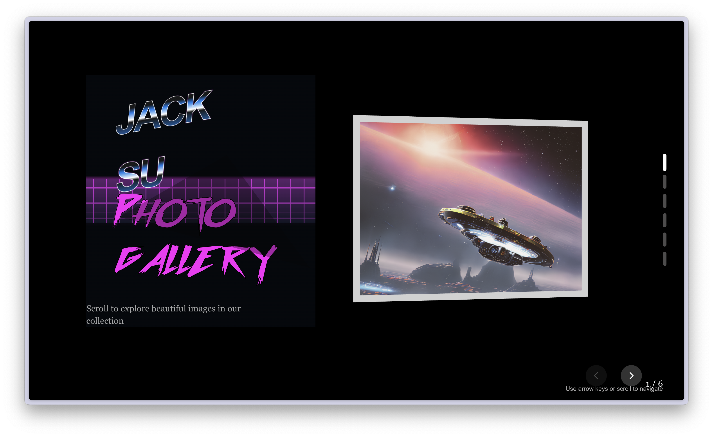

# RetroWave 3D Gallery

An immersive 3D gallery experience built with Next.js and Three.js, featuring a retro synthwave aesthetic. This project combines modern web technologies with 80s-inspired design to create a unique visual showcase.



## Features

- Stunning retro wave visual aesthetics with neon gradients
- Interactive 3D environment for showcasing gallery items
- Dynamic lighting effects and animations
- Responsive design that works across devices
- Smooth transitions between gallery sections
- Custom OutRun-inspired typography

## Technologies Used

- **Frontend**: Next.js, React
- **3D Rendering**: Three.js
- **Animation**: GSAP
- **Styling**: Tailwind CSS
- **Typography**: Custom OutRun font

## Getting Started

First, run the development server:

```bash
npm run dev
# or
yarn dev
```

Open [http://localhost:3000](http://localhost:3000) with your browser to see the gallery.

## Project Structure

- `app/` - Next.js application routes and main pages
- `components/` - Reusable React components
  - `GalleryHeader.tsx` - Retro wave styled header component
- `public/` - Static assets and resources

## Customization

You can customize gallery content by modifying:
- Title and subtitle text in pages
- 3D models and assets in the gallery scenes
- Color schemes through global CSS variables

## Inspiration

This project draws inspiration from:
- 80s synthwave and retrowave aesthetics
- New Retro Wave music scene
- Outrun arcade games
- Modern 3D web experiences

## License

[MIT](LICENSE)

---

Created by Jack Su
